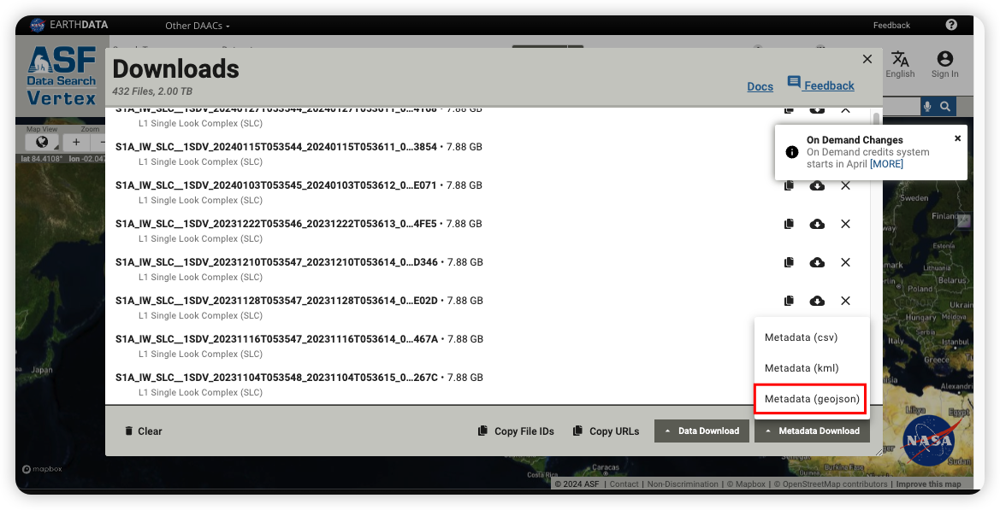

============================
Download Sentinel-1 from ASF 
============================

This tutorial demonstrates how to download Sentinel-1 data from the `ASF Data Search Vertex <https://search.asf.alaska.edu/>`_. 

.. tip::

    If you want to download Sentinel data from the `Sentinel official website <https://scihub.copernicus.eu/dhus/#/home>`_, please refer to the `Sentinel-2 Data Download Tutorial <base/sentinel2.rst>`_.

1. Select Sentinel-1 data
=========================

Go to the ASF Data Search Vertex: https://search.asf.alaska.edu/, and download the metadata in the ``.geojson`` format.

2. Download data 
================

2.1. Authorization
------------------

.. note::
    To download Sentinel data from the ASF Data Search Vertex, you need an account of NASA Earthdata. If you don't have one, please register at the https://urs.earthdata.nasa.gov/users/new . Then follow the official tutorial for authorizing ASF access: https://disc.gsfc.nasa.gov/earthdata-login

.. tip::

    Creating ``.netrc`` file allows you to save the account and password information for websites. When the program downloads, it will automatically read the corresponding account and password from this file, eliminating the need for repeated user input.

Replace ``your_username`` and ``your_password`` in the code below with your own username and password registered on the Sentinel official website, and execute it in a Python editor.

.. code-block:: python

    from data_downloader import downloader

    netrc = downloader.Netrc()
    netrc.add('urs.earthdata.nasa.gov', 'your_username', 'your_password')

After execution, a ``.netrc`` file will be created in the user's directory. 

.. note::

    If the account or password is entered incorrectly, set ``overwrite=True`` in the code above to overwrite the account and password in the ``.netrc`` file.

    .. code-block:: python

        netrc.add('urs.earthdata.nasa.gov', 'your_username', 'your_password', overwrite=True)

2.2 Bulk Download
-----------------

.. note::

    Following script will using ``geopandas`` to read the ASF metadata (``*.geojson``) and get the sentinel-1 urls. If you don't have ``geopandas`` installed, you can install it via pip:

    .. code-block:: bash

        pip install geopandas

Create a Python file, copy the code below, and modify the ``folder_out`` and ``asf_file`` paths according to your situation. Then execute it to download files in bulk.

.. tip::

    ``DataDownloader`` can **automatically skip downloaded files** and **support resumable downloads**. If the download is interrupted and some files are incomplete, simply re-execute this script.

.. code-block:: python

    import geopandas as gpd
    from data_downloader import downloader

    # Specify the folder to save the data
    folder_out = "/Volumes/Data/sentinel1"
    # Load the ASF metadata 
    asf_file = "/Volumes/Data/asf-datapool-results-2024-03-29_11-24-18.geojson"

    # get the sentinel-1 urls from the ASF metadata
    df_asf = gpd.read_file(asf_file)
    urls = df_asf.url

    # Download data
    downloader.download_datas(urls, folder_out)

.. image:: /_static/images/sentinel1/download.png
    :width: 100%

2.3 Retry Download
------------------

If your download is frequently interrupted, you can use the following code to automatically retry the download:

.. code-block:: python

    from pathlib import Path
    import geopandas as gpd
    from data_downloader import downloader

    # Specify the folder to save the data
    folder_out = Path("/Volumes/Data/sentinel1")
    # Load the ASF metadata 
    asf_file = "/Volumes/Data/asf-datapool-results-2024-03-29_11-24-18.geojson"

    # get the sentinel-1 urls from the ASF metadata
    df_asf = gpd.read_file(asf_file)
    urls = df_asf.url

    # Download data
    while True:
        try:
            downloader.download_datas(urls, folder_out)

            # check if the download is completed
            files_local = list(folder_out.glob("*.zip"))
            if len(files_local) >= len(urls):
                print("Download completed.")
                break
        except Exception as e:
            print(e)
            print("Retry download...")
            continue
